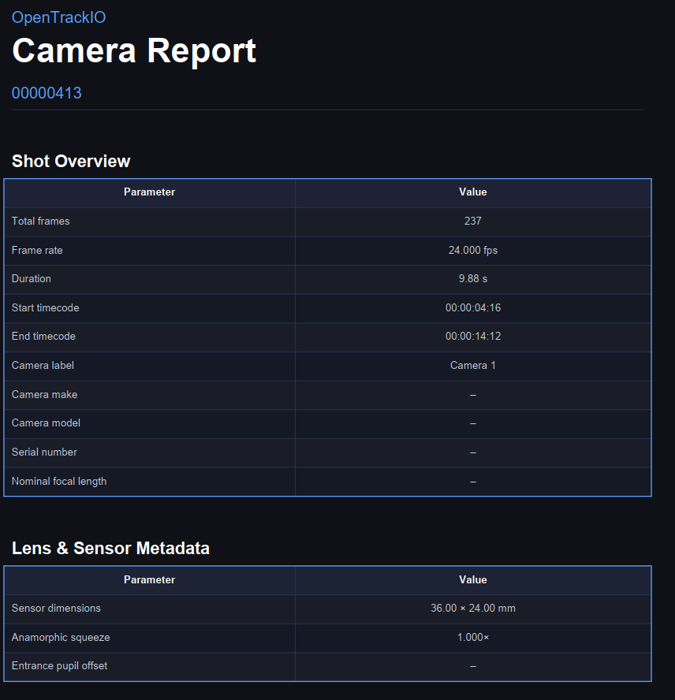
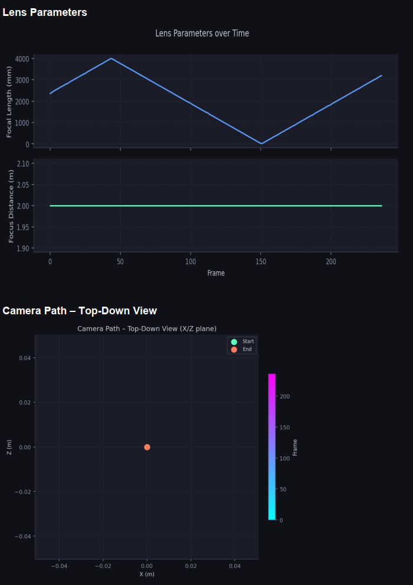

# OpenTrackIO FBX and Report Generator

Converts a folder of [OpenTrackIO](https://www.opentrackio.org) JSON frame files into an animated binary FBX camera file and a PDF report. Supports both single-sequence and batch processing. It is intended for use with the LOLED E2E FIZ Pro's data logging feature, but will work with any OpenTrackIO files.

## Outputs

For each sequence the tool produces:

- **`camera_animation.fbx`** — Binary FBX 7.4 with a fully animated camera (translation, rotation, focal length, focus distance). Compatible with Maya, Blender, Unreal Engine, Nuke, Houdini, and other DCCs.
- **`camera_report.pdf`** — A multi-page PDF containing a shot overview, lens and sensor metadata, min/max/mean statistics, position and rotation charts, a lens parameter chart, and a top-down camera path view.

## Requirements

Python 3.8+ and three pip packages:

```bash
pip install matplotlib numpy reportlab
```

## Usage

### Single sequence

Point the script at a folder containing `.json` frame files:

```bash
python opentrackio_converter.py /path/to/sequence/
```

### Batch mode

Point the script at a top-level folder whose immediate sub-folders each contain a sequence:

```bash
python opentrackio_converter.py /path/to/all_sequences/ --batch
```

Batch mode is also triggered **automatically** — if the input folder contains no `.json` files directly but its sub-folders do, the script will detect this and process them all without needing `--batch`.

#### Batch folder layout example

```
all_sequences/
├── shot_010/
│   ├── 00000001.json
│   ├── 00000002.json
│   └── ...
├── shot_020/
│   └── ...
└── shot_030/
    └── ...
```

Running `python opentrackio_converter.py all_sequences/` will produce:

```
all_sequences/
├── shot_010/
│   ├── camera_animation.fbx
│   └── camera_report.pdf
├── shot_020/
│   ├── camera_animation.fbx
│   └── camera_report.pdf
└── shot_030/
    ├── camera_animation.fbx
    └── camera_report.pdf
```

### Sending output to a separate directory

Use `--output-dir` to write all outputs to a different root. In batch mode each sequence still gets its own named sub-folder inside that root:

```bash
python opentrackio_converter.py /data/sequences/ --batch --output-dir /renders/
# Writes to: /renders/shot_010/, /renders/shot_020/, etc.
```

## Options

| Flag | Default | Description |
|---|---|---|
| `--fps FPS` | auto-detect | Override the frame rate |
| `--output-dir DIR` | same as input | Root directory for output files |
| `--fbx-name NAME` | `camera_animation.fbx` | FBX output filename |
| `--pdf-name NAME` | `camera_report.pdf` | PDF output filename |
| `--no-fbx` | — | Skip FBX generation |
| `--no-pdf` | — | Skip PDF generation |
| `--batch` | — | Force batch mode |

## Input format

Each `.json` file should represent one frame of camera data in the OpenTrackIO schema. The parser handles:

- Standard JSON (one object per file)
- NDJSON (one object per line)
- Concatenated JSON objects

Files with numeric stems (e.g. `00000417.json`) are sorted and used to derive frame numbers if timecode data is absent. Multiple sub-frame samples within a single file are averaged into one frame.

## FBX coordinate system

| OpenTrackIO | FBX |
|---|---|
| Translation X/Y/Z (metres) | Lcl Translation (centimetres, ×100) |
| Pan (°, Y-rotation) | Lcl Rotation Y |
| Tilt (°, X-rotation) | Lcl Rotation X |
| Roll (°, Z-rotation) | Lcl Rotation Z |
| Focal length (mm) | FocalLength (mm, unchanged) |
| Focus distance (metres) | FocusDistance (centimetres, ×100) |

Coordinate system: Y-up, right-handed (Maya default). Units: centimetres.



